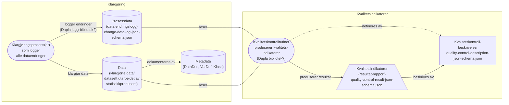

# Informasjonsmodell for kvalitetsindikatorer og prosessdata

- **Versjon:** 0.3 (2025-11-19)
- **Ansvarlig**: *Informasjonsmodellen er utabeidet av Seksjon for IT-arkitektur (S702) i samarbeid med Seksjon for metoder (S811), tech-coacher (S703) og støtte-team.*

## Bakgrunn

For å kunne skape nødvendige kvalitetsindikatorer spesifisert av Seksjon for metoder må alle dataendringer som uføres i statistikkproduksjonen (klargjøringen) dokumenteres. Endringene bør dokumenteres i form av logger med strukturerte og standardiserte formater. Alle prosesser som utfører endringer, manuelle eller automatiske, må logges. Det er behov for å skille mellom logging av:
- endring av enkelt-dataverdier for en enhet, eksempelvis endring av inntekt for person eller antall anstatte for en virksomhet
- sletting/fjerning av enheter, dvs. at alle data for en gitt enhet forkastes av ulike årsaker (eksempelvis dårlig kvalitet)
- oppretting av nye enheter, eksempelvis at data for en ny enhet opprettes manuelt eller imputeres

***Skissen viser hvordan kvalitetsindikatorer skapes fra prosessdata (data endringslogger) som oppstår under klargjøringsprosessen.*** 

---

### Spesifikasjon og grunnlagsdokumenter for utarbeidelse av informasjonsmodell for kvalitetsindikatorer og loggformat:

- [Standardutvalgets vedtak om anbefalte kvalitetsindikatorer](https://ssbno.sharepoint.com/sites/Avdelingerutvalgograd/SitePages/Vedtak-fra-Standardutvalget.aspx#kvalitetsindikatorer)

  - Se også [anbefalte kvalitetsindikatorer i offisiell statistikk](https://www.ssb.no/offentlig-sektor/offentlig-forvaltning/artikler/anbefalte-kvalitetsindikatorer-i-offisiell-statistikk)

- Arkitektur-veildedninger og [sporing av endring](https://statistics-norway.atlassian.net/wiki/spaces/Arkitektur/pages/3560243270/Sporing+av+endring)

- [Beskrivelse av behov for prosessdata](behov_prosessdata.docx) fra Seksjon for metoder

## Informasjonsmodell for prosessdata

Det er behov for et standardistert loggformat/struktur som alle statistikkprodusenter i SSB kan forholde seg til. Et standard loggformat vil også muliggjøre utvikling av standard loggfunksjonalitet (Python og R bibliotek) som kan benyttes av alle i SSB. Det er også behov for å støtte logging av endringer uført både i flate datastrukturer (f.eks. Pandas dataframes og database-tabeller) og i hierarkisek strukturer (f.eks. json og xml).

### Endringslogg-strukturen (prosessdata) spesifisert som et Json-schema:
- [change-data-log-json-schema.json](change-data-log-json-schema.json)

#### Eksempel-data og eksempler på endringslogger:

| fnr         | periode | bostedskommune  | type_loenn | loenn        | overtid_loenn | 
| ----------- | ------- | --------------- | ---------- | ------------ | ------------- |
| 311280nnnnn | 2023-12 | 0301            | fast       | 45 000       |  0            |
| 170598nnnnn | 2023-12 | 0101            | time       | 38 000       |  3000         |
| ..          | ..      | ..              | ..         | ..           |  ..           |
|             |         |                 |            |              |               |

- [Oppdatere (endre)](/process-data/example_log_change_data/example_data_change_log_1.json) en verdi for en enhet
- [Slette/fjerne](/process-data/example_log_change_data/example_data_delete_log_1.json) en enhet
- [Opprette en ny](/process-data/example_log_change_data/example_create_new_data_log_1.json) enhet
- Endre verdier i et [hierarkisk datasett](/process-data/example_log_change_data/example_change_hierarchical_data_log_1.json)

### Filformat for lagring av endringslogger (prosessdata)

Prosessdata skal formateres som [JSON Lines](https://jsonlines.org/examples/) iht. modellen spesifisert i [change-data-log-json-schema.json](change-data-log-schema.json). Det vil si at hver eneste dataendring *("create/insert", "update" eller "delete")* utgjør et JSON-objekt som lagres som en linje i prosessloggen. Prosesslogg-filene skal lagres som spesifisert i [Dapla navnestandard for datalagring](https://manual.dapla.ssb.no/statistikkere/navnestandard.html) og i dokumentet [behov for prosessdata](https://statistics-norway.atlassian.net/wiki/x/LIAE-/). *Legg også merke til at JSON Lines filer skal ha fil-endelsen "**.jsonl**"*.

Se også eksempel-implementasjon (Python-kode) av modellen i [ssb-fagfunksjoner](https://github.com/statisticsnorway/ssb-fagfunksjoner/tree/82b34c9/src/fagfunksjoner/log) i GitHub.

## Informasjonsmodell kvalitetskontroll-beskrivelser

Det er behov for en felles modell for kvalitetskontroll-beskrivelser. Denne er beskrevet som et Json schema:
- [quality-control-description-json-schema.json](quality-control-description-json-schema.json)

## Informasjonsmodell for kvalitetskontroll-resultater (kvalitetsindikatorer)

Felles modell for kvalitetskontroll-resultater (Json schema):
- [quality-control-result-json-schema.json](quality-control-result-json-schema.json)

## Anbefalinger - veien videre

Det er nå utarbeidet et forslag til felles modell for prosessdata (dataendringslogg) og kvalitetsindikatorer. **På kort sikt anbefales det derfor at informasjonsmodellen testes ut på én eller noen få utvalgte statistkker for å høste erfaringer.** På lengre sikt vil det være aktuelt å utvikle felles Dapla-funksjonalitet (Python/R) for logging av dataendringer og for å produsere kvalitetsindikatorer.

---

***Versjonsinformasjon for dette dokumentet***

| Versjon (dato)   | Versjonsbeskrivelse                                        |
| ---------------- | ---------------------------------------------------------- |
| 0.1 (2024-02-28) | Føste versjon. Presentert for Standardutvalget mars 2024.  |
| 0.2 (2024-12-03) | - Valg av JSON Lines som filformat for prosesslogger. - Oppdatert prosesslogg JSON Schema og JSON-eksempler. |
| 0.3 (2025-11-19) | - Oppdatert modell og eksempler etter workshop på Kongsvinger i november 2025. |